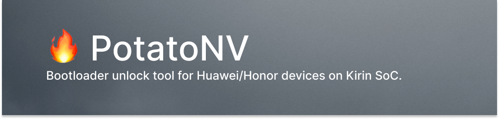

---

## Download

### 👉 [Click here to download the latest version](https://github.com/mashed-potatoes/PotatoNV/releases/download/2022.03/PotatoNV-next-v2.2.1_2022.03-x86.zip).

Get binaries for Windows in [the releases section](https://github.com/mashed-potatoes/PotatoNV/releases).
For Linux or macOS consider using the [PotatoNV-crossplatform](https://github.com/mashed-potatoes/PotatoNV-crossplatform).

## User manual

Follow the [video guide](https://www.youtube.com/watch?v=YkGugQ019ZY) or read the manual below.

### Make sure your device is compatible

0. Are you sure you're actually using a Huawei/Honor device?
1. Open the Settings → About phone. Check the CPU: it should be _**HiSilicon Kirin** \*\*\*_. If it is not your case (MediaTek, Qualcomm), then alas, your device is not supported. :(
2. Okay, now you know CPU model. It should be one of these modification:
    - Kirin 620
    - Kirin 650
    - Kirin 655
    - Kirin 658
    - Kirin 659
    - Kirin 925
    - Kirin 935
    - Kirin 950
    - Kirin 960
3. **100% incompatible CPUs with PotatoNV: Kirin 710, 710A, 710F, 810, 970, 980, 985, 990 & newer.**
4. As for Kirin 710, 710F, 970 & 980, there is an alternative option — [see the "Alternatives" section below](#alternatives).

## Entering VCOM Mode via Disassembly
<details>
    
### Removing the back cover

The first step is the most difficult thing to do. You need to disassemble your device: this is necessary in order to access the contacts on the motherboard.

> **Warning**
>
> I strongly recommend watching video manuals for disassembling your device.

> **Warning**
>
> **Be extremely careful with planar cables!**
>
> These cables are used in tablets, as well as in phones with a fingerprint scanner on the back cover.

You will need: a hair dryer, a guitar pick or a plastic card, conductive tweezers and maybe a screwdriver.

1. Turn off the device.
2. Heat the back cover evenly with a hair dryer.
3. After a couple of minutes, try to stick the plastic card into the corner between case and lid, try to lift the edge and then deepen the card.
4. Move around the perimeter of the back cover, peeling off glue.
5. Now you can remove the back cover.

### Entering download mode

It's time to Google. You need to find the location of a special point on the motherboard – testpoint.

> **Note**
>
> If you are wondering why you need to do something with the unfortunate testpoint, then read [the contents of the spoiler below](#how-it-works).

To search, use the model name before the hyphen + "testpoint".
For example for Honor 9 Lite (LLD-L31) you should Google ["lld testpoint"](https://www.google.com/search?q=lld+testpoint&tbm=isch).

<details>
<summary>An example how a typical testpoint photo looks like.</summary>


</details>

The marks may vary:

1. Only one point is marked in the photo.
2. In the photo, a line is drawn between the point and the metal shield.
3. In the photo, a line is drawn between two points.

Here you will need sleight of hand: try to short-circuit the point and the metal shield (in option 1 and 2), or short-circuit both points (option 3) with tweezers.
Without removing the tweezers, connect the USB cable to the computer.

After 3 seconds, the tweezers can be removed.

Open the "Device Manager" – you should see an unknown device named `USB SER`, or Serial Port `HUAWEI USB COM 1.0`.

If the device has not been detected, make sure you are using a good cable, the tweezers are not a dielectric, and you are shorting the desired point.
</details>

## Entering VCOM Mode without disassembly
<details>

- Download [Kirin-Tool](kirintool.cfd)
- Install  [Huawei Testpoint Drivers](https://files.dc-unlocker.com/share.html?v=share/18B15B9D02C945A79B1967234CECB423).

You're in this section because you don't want to bother disassembling your device.
However, it will be harder to do without disassembly, this is just a fair warning.
Note, this method only works with EMUI8≤ (FOR NOW!)

You'll need to find a dload firmware matching the exact same version as the one on your phone, or higher (maximum is a firmware with 2021.2 security patch for Software TP)
If you're on a version abovethe security patch, you'll need to downgrade via [Hisuite Proxy](https://github.com/ProfessorJTJ/HISuite-Proxy/wiki/Complete-Guide) and/or dload (via usb)

Once you are on a vulnerable version, you will need a dload firmware matching your firmware version, or above (region can differ, however a C00(all/cn) UPDATE.APP won't work on for example C432(hw/eu) this is only the case between global and chinese.

Now, this may be really tricky, or easy, or paid to find!
Here are some sites to look:

[Free #1 (IqinixFH)](iqinixfh.nopajeets.lol)

[Free #2 (firmwarefile)](firmwarefile.com)

[Paid #1 (Halabtech)](support.halabtech.com)

[Paid #2 (firmwaredrive)](firmwaredrive.com)

(You can also join [@kirintoolsupport](https://t.me/@kirintoolsupport) on telegram and request a firmware, we can *probably* provide it for free, no guarantees tho)

Once you have the firmware needed for software testpoint:
Open up Kirin-Tool, navigate to "VCOM Operations", open up the Software Testpoint part
Press "Browse", select the base UPDATE.APP for your phone (This will probably be in a "dload" folder, or a zip named update_sd_base.zip)
Shut down your phone (with the charger unplugged)

The next step will differ based on the software versions:
**EMUI9.1≥**: Hold both of your volume buttons, and connect the phone to your computer while doing so, hold until you see the updating screen with a usb icon in the middle.

**EMUI9.1≤**: Hold your volume up button, and connect the phone to the computer while doing so, hold until you see eRecovery, once you are there press "Update Mode" and select "USB Update Mode"

After doing the above steps depending on your software version, open up device manager and you should see 2 com ports(ignore other ones):
DBAdapter Reserved Interface
Android Adapter PCUI

In Kirin-Tool, press Enter (of course, after you have selected the UPDATE.APP)
Done, the phone will probably reboot and enter vcom, if you have any issues, please reach out to us! (@kirintoolsupport)

**WHEN YOU ARE DOING THE UNLOCK, DISABLE REBOOT AFTER UNLOCK, AND DO THE UNLOCK AFTER**
**ONCE UNLOCKED, AND YOU HAVE THE KEY, GO BACK TO KIRIN-TOOL AND PRESS "EXIT" AT THE SOFTWARE TESTPOINT TAB**

</details>

### Unlocking the bootloader

- Install [Fastboot Drivers](https://dl.google.com/android/repository/usb_driver_r13-windows.zip).
- Install [Huawei Testpoint Drivers](https://files.dc-unlocker.com/share.html?v=share/18B15B9D02C945A79B1967234CECB423).
- Download [the latest release](https://github.com/mashed-potatoes/PotatoNV/releases) of PotatoNV.
- Start PotatoNV.

> **Note**
>
> All bootloaders are flashing to RAM, so an incorrect bootloader cannot harm the device.

> **Note**
>
> `Disable FBLOCK` checkbox disables a special security check.
> That modification allows you to flash/erase secure partitions or execute oem commands,
> that are not available with normal unlocking by unlock code \[`USERLOCK`].

> **Warning**
>
> `FBLOCK` unlocking works correctly only on devices with Kirin 960 or Kirin 65x.
> Disabling this option can cause serious problems on legacy devices.

Okay, now refer to [this table](#tested-devices) and select the appropriate bootloader.

Press the Start button. 🪄

The procedure will take no more than a minute.
The program should write a new unlock code, keep it in a safe place.

Reboot your device to fastboot mode and execute following command on the host machine:

```shell
fastboot oem unlock YOUR_CODE_HERE
```

have fun.
<!-- right, anti? :) -->

## How it works

<details>

Even before creating PotatoNV, [@TishSerg](https://github.com/TishSerg) discovered that unlock key can be rewritten with the **SHA256 hash** of the desired key to the `USRKEY` property. However, to access **_NVME_** _(a raw partition that stores stuff like serial number, device traits, etc.)_, a user should flash _custom_ recovery or gain temporary root privileges. But both methods are complex and are not guaranteed to work. After researching the legacy bootloader of some Huawei devices, I've found a `nve` command, which allows to read or write any property in the **_NVME_** partition. Of course, this command requires an unlocked bootloader.
So it remains to find a way to quickly unlock the bootloader. The way out is quite simple - use the bootloader from the board software.

The program uploads a special **_"USB bootloader"_** _(exported from the board software)_ through the `DOWNLOAD_VCOM` mode. **_VCOM_** is smth like **_EDL_** on Qualcomm devices: it can be triggered by a system failure or by **shorting testpoint**.
After uploading the bootloader, the device should switch to the fastboot mode. The "USB bootloader" has an important trait: it's **unlocked out-of-the-box**, so it allows to execute any command.

So, we're just going to send a command through the USB bulk interface to write SHA256 hash to USRKEY and reboot the device.

That's it.
</details>

## Tested devices

Device | Model | Bootloader
------ | ----- | ----------
Huawei P8 Lite (2015) | `ALE` | Kirin 620
Huawei Y6II | `CAM` | Kirin 620
Honor 5C / 7 Lite | `NEM` | Kirin 65x (A)
Honor 6X | `BLN` | Kirin 65x (A)
Honor 7X | `BND` | Kirin 65x (A)
Honor 9 Lite | `LLD` | Kirin 65x (A)
Huawei MediaPad T5 | `AGS2` | Kirin 65x (A)
Huawei Nova 2 | `PIC` | Kirin 65x (A)
Huawei P10 Lite | `WAS` | Kirin 65x (A)
Huawei P20 Lite / Nova 3e | `ANE` | Kirin 65x (A)
Huawei P8 Lite (2017) | `PRA` | Kirin 65x (A)
Huawei P9 Lite | `VNS` | Kirin 65x (A)
Huawei Y9 (2018) | `FLA` | Kirin 65x (A)
Huawei MediaPad M5 Lite | `BAH2` | Kirin 65x (B)
Huawei Nova 2i / Mate 10 Lite | `RNE` | Kirin 65x (B)
Huawei P Smart 2018 | `FIG` | Kirin 65x (B)
Honor 6 Plus | `PE` | Kirin 925
Honor 7 | `PLK` | Kirin 935
Huawei P8 | `GRA` | Kirin 935
Honor 8 Pro / V9 | `DUK` | Kirin 950
Honor 8 | `FRD` | Kirin 950
Huawei P9 Standart | `EVA` | Kirin 950
Honor 9 | `STF` | Kirin 960
Huawei Mate 9 Pro | `LON` | Kirin 960
Huawei Mate 9 | `MHA` | Kirin 960
Huawei MediaPad M5 | `CMR` | Kirin 960
Huawei Nova 2s | `HWI` | Kirin 960
Huawei P10 | `VTR` | Kirin 960

## Alternatives

#### Kirin-Tool

Kirin-Tool is a tool capable of unlocking the bootloader on the following devices:

- Kirin 710 / 710F
- Kirin 970
- Kirin 980

It is available free of charge. Supports additional features such as free rebranding for Kirin 980 devices.

Only works on EMUI 9.1 and below.

- Website: https://kirintool.cfd
- Support: https://t.me/kirintoolsupport

#### HCU Client

Supports a wide range of devices across multiple chipsets (Kirin, MediaTek, and Qualcomm) released up to 2021. The product is no longer actively updated, but it still performs reliably.

The most affordable license plan provides 3 days of access for €19.

See supported models by HCU Client [here](https://hcu-client.com/supported-models.php).

> **Note**
> 
> [Timed licenses locked to first used PC](https://hcu-client.com/buy/#:~:text=Timed%20licenses%20locked%20to%20first%20used%20PC) for two days.
> Therefore, it would be problematic to use such a license on more than one phone.

###### Disclaimer: I am not affiliated, associated, authorized, endorsed by, or in any way officially connected with UAB Digiteka, or any of its subsidiaries or its affiliates, including DC-Phoenix and HCU Client.

## License

Logo by Icons8.

All bootloaders are Huawei Technologies Co., Ltd. property.

This project is not affiliated with Huawei.

---

Bootloader unlock tool for Huawei devices on Kirin SoC.
Copyright (C) 2019-2020  mashed-potatoes

This program is free software: you can redistribute it and/or modify
it under the terms of the GNU General Public License as published by
the Free Software Foundation, either version 3 of the License, or
(at your option) any later version.

This program is distributed in the hope that it will be useful,
but WITHOUT ANY WARRANTY; without even the implied warranty of
MERCHANTABILITY or FITNESS FOR A PARTICULAR PURPOSE.  See the
GNU General Public License for more details.

You should have received a copy of the GNU General Public License
along with this program.  If not, see <https://www.gnu.org/licenses/>.

---

Thank you, Martin, Moisés, Tibor, Emanuele & all those I've forgotten (sorry!).
